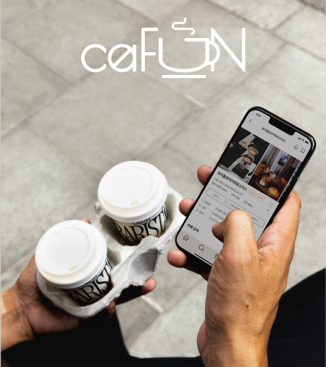

# CAFE FUN

## 프로젝트 소개

이 레포지토리는 카페 애플리케이션의 **백엔드 기능**을 제공합니다. 현재 서버 배포가 진행 중이며, 레포지토리 파일에는 `serviceAccountKey`가 포함되어 있지 않아 Firebase 관련 오류가 발생할 수 있습니다. 직접 실행을 원하시는 경우, 프론트엔드 레포지토리에서 제공하는 APK 파일을 다운로드하여 기능을 체험하실 수 있습니다.

## 다운로드

[앱 다운로드 (APK)](https://github.com/NIsik419/Open_Cafe_spring/releases/download/asdf/CafeFun.apk)

### 개발 배경

현재 네이버에서는 리뷰 평점 기능이 사라지면서, 사용자가 카페를 찾을 때 리뷰 수가 많은 가게로 추천이 편향되는 문제가 발생하고 있습니다. 이는 개인의 취향과 무관한 추천 결과를 낳을 수 있으며, 사용자 경험을 저하시킬 수 있습니다. 이러한 문제를 해결하고자, 본 프로젝트는 **사용자 맞춤형 키워드 추천 기능**에 중점을 두고 설계되었습니다.

### 핵심 목표

1. **키워드 기반 추천**
   - 실제 리뷰에서 추출한 키워드를 분석하여 각 카페의 대표 키워드를 정의
   - 사용자가 선호하는 키워드와 높은 적합성을 가진 카페를 추천

2. **데이터 공유를 통한 추천 강화**
   - **북마크**, **리뷰**, **방문 기록** 데이터를 기반으로 사용자 간 정보를 공유
   - 이러한 데이터를 활용해 추천 알고리즘의 정밀도를 지속적으로 개선

3. **사용자 경험 최적화**
   - 단순히 리뷰 수나 평점에 의존하지 않고, 사용자 개인의 취향을 반영한 추천 제공
   - 사용자와 카페 간의 적합도를 높여 만족스러운 결과를 도출

## 데이터베이스 구축 과정

### 1. 데이터 수집

- **네이버 리뷰 크롤링**
  - Python을 사용하여 네이버 카페 리뷰를 크롤링하고 데이터베이스에 저장
  - 크롤링 스크립트는 `BeautifulSoup`과 `Requests` 라이브러리를 활용

### 2. 키워드 추출 및 분류

- **텍스트 전처리**
  - 리뷰 데이터를 정제하여 분석에 적합한 형태로 변환
  - 불용어 제거, 토큰화 등의 전처리 작업 수행

- **키워드 추출**
  - `KoNLPy` 라이브러리를 사용하여 리뷰에서 명사와 형용사 추출
  - TF-IDF 알고리즘을 적용하여 중요한 키워드 식별

- **키워드 분류 알고리즘**
  - 추출된 키워드를 명사 사전과 형용사 사전으로 분류
  - 이를 통해 카페의 특성을 반영한 세부 카테고리 생성
  - Python으로 구현된 분류 알고리즘을 통해 자동화된 키워드 분류 수행

## 로그인 화면 *사진 누르시면 유튜브로 넘어갑니다

### 로그인 주요 서비스

1. **사용자 정보 수집**
   - 유저 닉네임, 생년월일, 선호 키워드, 위치 정보를 수집하여 맞춤형 서비스 제공

2. **유저 캐릭터 생성**
   - 유저의 선호 키워드를 기반으로 4가지의 특징 있는 캐릭터 중 하나를 생성
   - 각 캐릭터는 고유한 키워드 카테고리를 가지며, 이를 통해 사용자 특성을 반영

3. **추천 알고리즘 연결**
   - 온보딩 후 초기 화면에서 생성된 캐릭터를 기반으로 카페 추천 알고리즘 실행
   - 캐릭터의 분위기와 키워드 카테고리에 맞는 카페를 우선 추천하여 사용자 만족도 향상

---

## 주요 서비스 설명

### 1. 홈 화면
- **추천 카페 리스트**
  - 초기 온보딩에서 생성된 유저 캐릭터를 기반으로 추천 알고리즘을 실행하여 유저의 취향에 맞는 카페를 카드 리스트 형식으로 제공합니다.
- **최근 방문 카페**
  - 사용자가 방문한 카페가 있다면, 최근 방문한 카페 리스트를 추가로 보여줍니다.

---

### 2. 검색 화면
- **검색 기능**
  - 초기에는 카페 이름, 키워드, 편의시설 등으로 검색 가능하도록 설계했으나, 현재 키워드와 이름 검색이 엉켜 작동하는 문제가 있어 키워드와 편의시설 검색만 가능하도록 수정되었습니다.
  - 검색 관련 오류는 추후 개선 및 기능 확장을 계획하고 있습니다.

---

### 3. 커뮤니티
- **현재 상태**
  - 초기에는 유저와 친구 또는 다른 사용자들과 정보를 공유하는 커뮤니티 기능을 목표로 했으나, 시간상의 이유로 현재는 디스플레이만 구현된 상태입니다.
- **추후 계획**
  - 커뮤니티 기능을 확장하여 정보 공유와 소통이 가능하도록 개발 예정입니다.

---

### 4. 카페 디테일 페이지
- **카페 기본 정보**
  - 카페의 주소, URL, 편의시설 등 기본 정보를 제공하며, 일부 카페는 메뉴 정보를 포함합니다.
  - 메뉴 정보가 없는 카페의 경우 기본 메뉴셋을 설정하여 제공.
- **주문 기능**
  - 사용자 편의를 위해 주문 기능을 구현했으나, 현재 실제 카페와 연결되지 않고 내부적으로 주문 시 방문 처리가 가능하도록 설계되었습니다.
  - 추후 리뷰 및 방문 기록 연계 기능을 강화할 계획입니다.

---

### 5. 마이페이지
- **캐릭터 정보**
  - 유저의 캐릭터 정보와 선호 키워드 확인 가능.
- **최근 방문 카페**
  - 최근 방문한 카페 리스트를 확인하고, 해당 카페에 대한 리뷰를 작성할 수 있습니다.
- **북마크 카페**
  - 사용자가 저장한 북마크 카페를 조회 가능.
- **쿠폰북**
  - 사용 가능한 쿠폰 정보 제공.

---

### 6. 리뷰 기능
- **리뷰 작성**
  - 최근 방문한 카페에 대해 다음 내용을 포함한 리뷰 작성 가능:
    - 리뷰 내용
    - 카페에서 마음에 든 키워드 선택
    - 평점 입력
- **데이터 활용**
  - 리뷰 데이터를 기반으로 추천 알고리즘 개선 및 카페 정보 업데이트.

---

### 추후 개선
**검색 기능 개선**
   - 현재 키워드와 이름 검색이 엉키는 문제를 해결하고, 이름, 키워드, 편의시설 모두를 활용한 완전한 검색 기능 구현 계획.
**커뮤니티 기능 확장**
   - 현재 디스플레이만 구현된 커뮤니티를 완성하여 유저 간 정보 공유와 소통 기능 추가 예정.

### 참고 자료
- 기존에 기획했던 프로젝트를 새로 진행한거라 디자인은 협업 관계 맺은 디자이너에게서 도움받았었습니다. (캐릭터,UI,UX 등)

## 사용 기술

- **백엔드 프레임워크**: Springboot
- **프론트 프레임워크**: Flutter
- **데이터베이스**: MySQL,h2database
- **인증**: Firebase Authentication
- **크롤링 및 데이터 처리**: Python (BeautifulSoup, Requests, KoNLPy)
- **배포**: AWS

